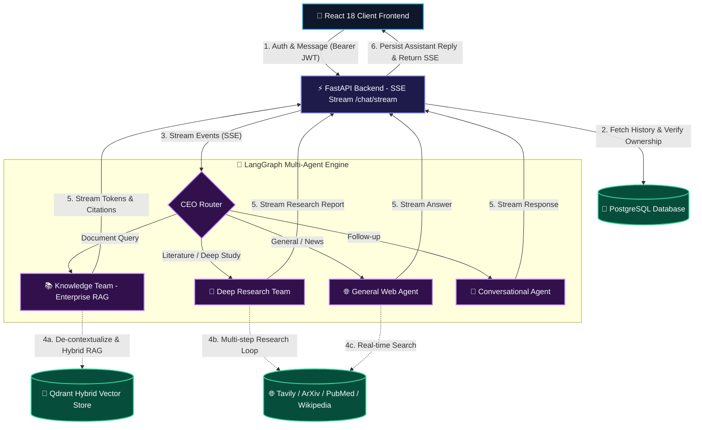
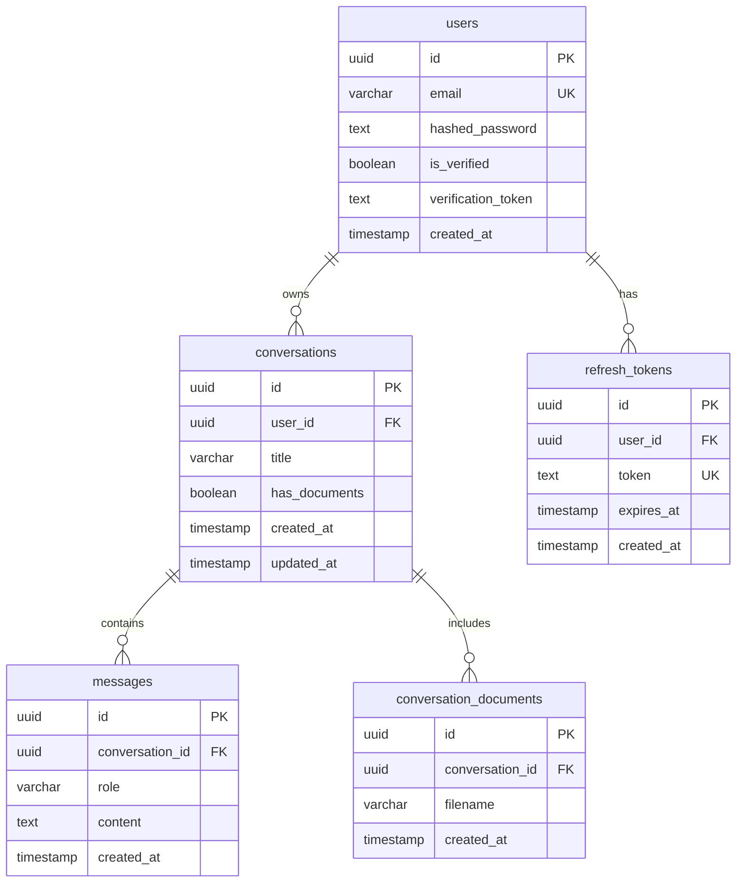

# Praxis 🧠

**Praxis** is a state-of-the-art, hierarchical Multi-Agent AI Platform with real-time **Server-Sent Events (SSE) streaming**, **Enterprise Document RAG**, and **Deep Multi-Domain Research**.

Operating like a digital corporation, a top-level **CEO Orchestrator** analyzes user intent and dynamically routes queries to specialized AI departments (**Enterprise Knowledge Team**, **Deep Research Team**, **General Agent**, or **Conversational Follow-Up Agent**) for precise, hallucination-resistant responses.

---

## 🏗 Architecture & Flow

The backend utilizes a fully stateless `langgraph` execution model. Conversation state is persisted in **PostgreSQL** and injected per-request, enabling horizontal auto-scaling and zero session affinity requirements.



---

## ✨ Key Features

- **Real-Time SSE Streaming (`/api/v1/chat/stream`):** Live token-by-token text streaming and animated step-by-step progress status updates (*"Refining query context..."* → *"Searching vector index..."* → *"Synthesizing response..."*).
- **Modular Production Architecture:** Clean separation of concerns with domain-based database packages (`app/db/`), request validation schemas (`app/schemas/`), dedicated business services (`app/services/`), and pluggable tool packages (`agents/tools/`).
- **Enterprise Document RAG Pipeline:**
  - **Conversational Query De-contextualization:** Resolves ambiguous pronouns (*"it"*, *"this"*, *"section 2"*) against chat history into explicit search queries before vector lookup.
  - **Adaptive Web Search Gating:** Evaluates document context completeness first—skipping web search when internal documents contain complete information (50% speedup, zero web noise).
  - **Grounded Citations:** Formats responses with explicit document source attributions (`[Source: document.pdf]`).
- **Multi-Domain Deep Research Team:** Multi-step iterative research planner executing multi-query searches across **ArXiv** (CS/AI), **PubMed** (Biomedical), **Wikipedia**, and **Tavily Web & News Search**.
- **Stateless Execution Model:** Stateless LangGraph architecture backed by PostgreSQL for infinite horizontal scaling across cloud instances.
- **Security & Multi-Tenant Data Isolation:** JWT authentication (`HS256`), password hashing (`bcrypt`), email verification tokens, endpoint rate-limiting (`slowapi`), 20 MB file upload limit, file type validation, and strict database conversation ownership verification.
- **Modern Responsive UI:** Built with Vite + React 18, featuring brand logo identity, dark glassmorphism aesthetic, mobile off-canvas drawer sidebar, and fail-safe HTTP fallback.

---

## 📊 Database Schema

Praxis uses **PostgreSQL** with `pgcrypto` for UUID generation. Below is the relational schema and operational purpose of each table:



### Table Operational Descriptions

| Table Name | Primary Purpose | Key Columns & Operational Role |
|---|---|---|
| `users` | Stores registered user accounts | `id` (UUID PK), `email` (Unique), `hashed_password` (Bcrypt hash), `is_verified` (Email status). Used for authentication and data ownership isolation. |
| `conversations` | Manages chat threads | `id` (UUID PK), `user_id` (FK → users.id), `title` (auto-generated 3-5 word summary), `has_documents` (Boolean gate used by CEO router). |
| `messages` | Persists conversation message history | `id` (UUID PK), `conversation_id` (FK → conversations.id), `role` (`user`, `assistant`, `system`), `content` (Markdown text). Injected per-request for stateless execution. |
| `refresh_tokens` | Multi-session auth & token rotation | `id` (UUID PK), `user_id` (FK → users.id), `token` (64-char opaque secret), `expires_at` (7-day expiry). Enables instant session revocation. |
| `conversation_documents` | Tracks ingested files attached to threads | `id` (UUID PK), `conversation_id` (FK → conversations.id), `filename` (Ingested PDF, DOCX, TXT file name). |

---

## 📂 Project Structure

```text
praxis-ai/
├── app/
│   ├── main.py             # FastAPI entry point, CORS & middleware
│   ├── config.py           # Environment settings & DEFAULT_MODEL
│   ├── dependencies.py     # Shared asyncpg pool dependency
│   ├── email.py            # Verification email integration
│   ├── db/                 # Modular Database Package
│   │   ├── connection.py   # Pool lifecycle & DDL schema
│   │   ├── users.py        # User CRUD & email verification
│   │   ├── conversations.py# Conversation CRUD & title updates
│   │   ├── messages.py     # Message history read & write
│   │   ├── documents.py    # Document tracking & Qdrant cleanup
│   │   ├── refresh_tokens.py# Refresh token lifecycle & revocation
│   │   └── __init__.py     # Database export hub
│   ├── schemas/            # Pydantic Schemas Package
│   │   ├── auth.py         # Auth DTO models
│   │   ├── chat.py         # Chat & message DTO models
│   │   ├── conversations.py# Conversation DTO models
│   │   ├── ingest.py       # Ingestion DTO models
│   │   ├── health.py       # Health DTO models
│   │   └── __init__.py     # Schemas export hub
│   ├── services/           # Business Logic Layer
│   │   ├── chat.py         # Auto-title generation service
│   │   ├── ingestion.py    # Document ingestion pipeline
│   │   └── __init__.py     # Services export hub
│   ├── routers/            # Thin HTTP APIRouters
│   │   ├── chat.py         # Sync (/chat) & SSE Streaming (/chat/stream) endpoints
│   │   ├── conversations.py# Conversation history & document endpoints
│   │   ├── ingest.py       # File upload & document ingestion router
│   │   └── health.py       # System health check endpoint
│   ├── auth/               # Authentication module
│   │   ├── router.py       # Auth endpoints (/register, /login, /refresh, /logout, /me)
│   │   ├── security.py     # Password hashing (bcrypt) & JWT token lifecycle
│   │   └── dependencies.py # JWT bearer token authorization dependency
│   └── middleware/         # App middleware
│       └── rate_limit.py   # Slowapi rate-limiting configuration
├── agents/
│   ├── orchestrator.py     # CEO router node & SSE event stream generator
│   ├── utils.py            # Shared agent utilities (formatting, prompts)
│   ├── tools/              # Pluggable Tools Package
│   │   ├── web_search.py   # Tavily web & news search
│   │   ├── academic.py     # arXiv & PubMed search
│   │   ├── encyclopedia.py # Wikipedia search
│   │   ├── retriever.py    # Hybrid Qdrant retriever
│   │   ├── time_utils.py   # Timezone-aware date/time helper
│   │   └── __init__.py     # Tools export hub
│   └── subgraphs/
│       ├── knowledge_team.py # Enterprise RAG pipeline (De-contextualization, Gated Web, Citations)
│       ├── research_team.py  # Deep multi-step academic research team
│       └── general_agent.py  # ReAct web & news search agent
├── prompts/
│   ├── orchestrator_prompts.py
│   ├── knowledge_prompts.py
│   ├── research_prompts.py
│   └── general_prompts.py
├── frontend/
│   ├── src/
│   │   ├── components/     # React components (ChatWindow, Sidebar, MessageItem, AuthModal)
│   │   ├── context/        # AuthContext state provider with toast notifications
│   │   ├── services/       # API client with SSE fetch stream reader
│   │   └── styles/         # Glassmorphism dark theme CSS
│   └── public/
│       ├── logo.png        # Brand logo asset
│       └── favicon.png     # Browser favicon
├── Dockerfile              # Production Docker container definition
├── deploy.sh               # EC2 deployment automation script
└── requirements.txt        # Backend python dependencies
```

---

## 🚀 Setup and Installation

### 1. Prerequisites
- Python 3.10+
- PostgreSQL instance (RDS or local)
- Qdrant Cloud or local Qdrant instance
- API Keys: OpenAI, Tavily, LlamaCloud

### 2. Install Dependencies
```bash
# Backend dependencies
pip install -r requirements.txt

# Frontend dependencies
cd frontend
npm install
```

### 3. Environment Variables (`.env`)
Create a `.env` file in the root directory:
```env
# API Server
API_HOST=0.0.0.0
API_PORT=8000

# PostgreSQL Database
POSTGRES_HOST=localhost
POSTGRES_PORT=5432
POSTGRES_USER=postgres
POSTGRES_PASSWORD=your_password
POSTGRES_DB=praxis

# Qdrant Vector Store
QDRANT_URL=http://localhost:6333
QDRANT_API_KEY=your_qdrant_api_key
QDRANT_COLLECTION_NAME=praxis_documents

# API Keys
OPENAI_API_KEY=sk-...
TAVILY_API_KEY=tvly-...
LLAMA_CLOUD_API_KEY=llx-...

# Auth & Security
SECRET_KEY=your_super_secret_jwt_key
```

### 4. Run Backend & Frontend

**Backend**:
```bash
python -m app.main
```
*(Runs on `http://localhost:8000`. Swagger API docs at `http://localhost:8000/docs`).*

**Frontend**:
```bash
npm --prefix frontend run dev
```
*(Runs on `http://localhost:5173`).*

---

## 📖 API Usage Guide

### 1. Register & Obtain JWT Tokens
```bash
curl -X POST http://localhost:8000/api/v1/auth/register \
  -H "Content-Type: application/json" \
  -d '{
    "email": "user@example.com",
    "password": "securepassword123"
  }'
```

### 2. Stream Chat Responses in Real-Time (SSE)
```bash
curl -N -X POST http://localhost:8000/api/v1/chat/stream \
  -H "Authorization: Bearer <YOUR_ACCESS_TOKEN>" \
  -H "Content-Type: application/json" \
  -d '{
    "conversation_id": "<CONVERSATION_UUID>",
    "message": "Summarize the uploaded document's key conclusions."
  }'
```
*Output: Streams real-time `event: agent_start`, `event: token`, and `event: done` payloads.*
