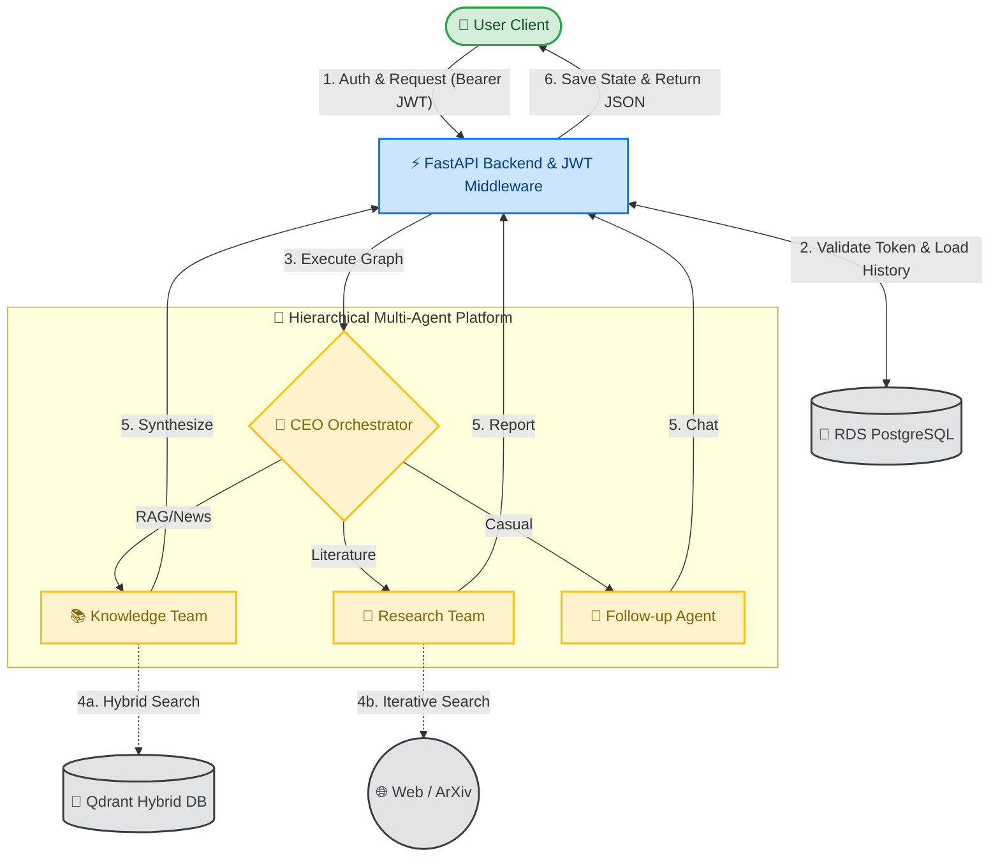

# Praxis 🧠

**Praxis** is a robust, stateless, hierarchical Multi-Agent API built for complex reasoning and enterprise-scale task execution. Instead of relying on a single monolithic prompt, Praxis operates like a digital corporation: a top-level **CEO Orchestrator** analyzes user requests and dynamically routes them to specialized AI sub-teams (e.g., Knowledge Team or Research Team) for precise, cost-effective, and hallucination-resistant responses.

---

## 🏗 Architecture

The system utilizes a fully stateless design via `langgraph`, meaning conversational memory is persisted in a PostgreSQL database and injected per-request, enabling infinite horizontal scaling across cloud instances.



---

## ✨ Key Features

- **Stateless Execution:** Conversation history is fetched from AWS RDS PostgreSQL and injected per-request, preventing memory bloat and enabling horizontal auto-scaling.
- **Hierarchical Multi-Agent Architecture:** Powered by `langgraph` to isolate execution context between sub-teams (Knowledge vs. Research), reducing token usage and eliminating prompt pollution.
- **Secure JWT Authentication:** Built-in registration, login, token refresh, and device revocation using `HS256` signed Access & Refresh tokens.
- **Rate Limiting & Protection:** Built-in endpoint throttling (`slowapi`) preventing API abuse (e.g., 20 msgs/min per user).
- **Hybrid Document Retrieval:** Qdrant vector store combining dense (`text-embedding-3-small`) and sparse (`FastEmbedSparse BM25`) embeddings with strict metadata filtering per `user_id` and `conversation_id`.
- **Dual Ingestion Pipeline:** Document parsing powered by `LlamaParse` via public URL (`/api/v1/ingest`) or direct file upload (`/api/v1/ingest/file`).
- **Academic & Web Research:** Automated multi-step research loops combining web search (Tavily) and paper metadata extraction (`arxiv`).
- **Docker & CI/CD Ready:** Includes container setup (`Dockerfile`), deployment automation (`deploy.sh`), and GitHub Actions workflow (`.github/workflows/deploy.yml`).

---

## 📂 Project Structure

```text
praxis-ai/
├── app/
│   ├── main.py             # FastAPI entry point, middleware & router inclusion
│   ├── database.py         # PostgreSQL connection pool & query helpers
│   ├── dependencies.py     # Shared database pool dependency
│   ├── schemas.py          # Pydantic request/response validation models
│   ├── config.py           # Environment variables (pydantic-settings)
│   ├── routers/            # Modular API Routers
│   │   ├── chat.py         # Main /chat endpoint & auto-titling logic
│   │   ├── conversations.py# /conversations endpoints
│   │   ├── ingest.py       # URL & File ingestion endpoints
│   │   └── health.py       # System health check endpoint
│   ├── auth/               # Authentication module
│   │   ├── router.py       # Auth endpoints (/register, /login, /refresh, /me)
│   │   ├── security.py     # Password hashing & JWT generation
│   │   └── dependencies.py # JWT bearer token validation dependencies
│   └── middleware/         # App middleware
│       └── rate_limit.py   # Slowapi rate-limiting configuration
├── agents/
│   ├── orchestrator.py     # CEO router node & LangGraph entry point
│   ├── tools.py            # LangChain tool definitions (Tavily, arXiv, Qdrant)
│   └── subgraphs/
│       ├── knowledge_team.py # RAG + Web search synthesizer team
│       └── research_team.py  # Multi-step academic research team
├── prompts/
│   ├── orchestrator_prompts.py
│   ├── knowledge_prompts.py
│   └── research_prompts.py
├── scripts/
│   └── ingestion.py        # LlamaParse + Qdrant hybrid ingestion pipeline
├── .github/
│   └── workflows/
│       └── deploy.yml      # CI/CD deployment pipeline to AWS EC2
├── Dockerfile              # Docker container definition
├── deploy.sh               # EC2 deployment automation script
├── .env                    # Environment secrets
└── requirements.txt        # Dependencies
```

---

## 🚀 Setup and Installation

### 1. Prerequisites
- Python 3.10+ (or Conda)
- AWS RDS (PostgreSQL) or local PostgreSQL instance
- Qdrant Cloud or local Qdrant instance
- API Keys: OpenAI, Tavily, LlamaCloud

### 2. Install Dependencies
```bash
conda create -n mgpt python=3.11
conda activate mgpt
pip install -r requirements.txt
```

### 3. Environment Variables
Create a `.env` file in the root directory:
```env
# API Server
API_HOST=0.0.0.0
API_PORT=8000

# PostgreSQL
POSTGRES_HOST=your-rds-endpoint.amazonaws.com
POSTGRES_PORT=5432
POSTGRES_USER=praxis
POSTGRES_PASSWORD="your_password_in_quotes_if_special_chars"
POSTGRES_DB=postgres

# Qdrant
QDRANT_URL=http://your-qdrant-ip:6333
QDRANT_API_KEY=your_qdrant_api_key
QDRANT_COLLECTION_NAME=collection

# API Keys
OPENAI_API_KEY=sk-...
TAVILY_API_KEY=tvly-...
LLAMA_CLOUD_API_KEY=llx-...

# JWT Auth Secret
SECRET_KEY=your_super_secret_jwt_key
```

### 4. Run Locally
```bash
python -m app.main
```
*(Server will run on `http://localhost:8000`. Swagger API docs available at `http://localhost:8000/docs`).*

### 5. Run via Docker
```bash
docker build -t praxis-backend .
docker run -p 8000:8000 --env-file .env praxis-backend
```

---

## 📖 API Usage Guide

### 1. Register & Obtain JWT Token
```bash
curl -X POST http://localhost:8000/api/v1/auth/register \
  -H "Content-Type: application/json" \
  -d '{
    "email": "user@example.com",
    "password": "securepassword123"
  }'
```
*Response:*
```json
{
  "access_token": "<YOUR_ACCESS_TOKEN>",
  "refresh_token": "<YOUR_REFRESH_TOKEN>",
  "token_type": "bearer"
}
```

### 2. Create a Conversation
```bash
curl -X POST http://localhost:8000/api/v1/conversations \
  -H "Authorization: Bearer <YOUR_ACCESS_TOKEN>" \
  -H "Content-Type: application/json" \
  -d '{"title": "Research Session"}'
```
*Response:*
```json
{
  "conversation_id": "<CONVERSATION_UUID>"
}
```

### 3. Ingest a Document
**Option A: Public URL or S3 link**
```bash
curl -X POST http://localhost:8000/api/v1/ingest \
  -H "Authorization: Bearer <YOUR_ACCESS_TOKEN>" \
  -H "Content-Type: application/json" \
  -d '{
    "source_url": "https://example.com/sample.pdf",
    "conversation_id": "<CONVERSATION_UUID>"
  }'
```

**Option B: Direct File Upload (Multipart Form)**
```bash
curl -X POST http://localhost:8000/api/v1/ingest/file \
  -H "Authorization: Bearer <YOUR_ACCESS_TOKEN>" \
  -F "file=@/path/to/local/file.pdf" \
  -F "conversation_id=<CONVERSATION_UUID>"
```

### 4. Send a Chat Request
```bash
curl -X POST http://localhost:8000/api/v1/chat \
  -H "Authorization: Bearer <YOUR_ACCESS_TOKEN>" \
  -H "Content-Type: application/json" \
  -d '{
    "conversation_id": "<CONVERSATION_UUID>",
    "message": "Explain the architectural differences between Transformers and RNNs based on the literature."
  }'
```
*Response:*
```json
{
  "conversation_id": "<CONVERSATION_UUID>",
  "answer": "...",
  "route_taken": "research_team"
}
```
