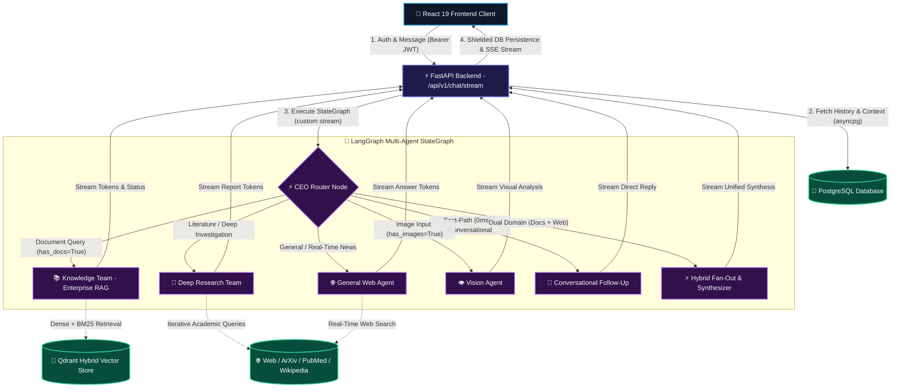
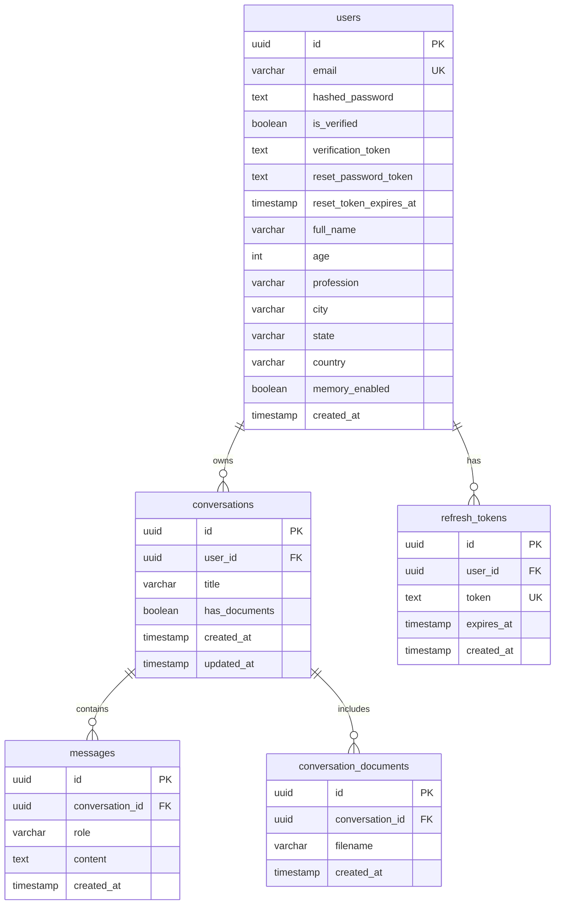

# Praxis 🧠

**Praxis** is a production-grade, hierarchical Multi-Agent AI Platform built with **FastAPI**, **LangGraph**, **PostgreSQL (asyncpg)**, and **Qdrant**. It delivers real-time **Server-Sent Events (SSE) streaming**, **Enterprise Document RAG (CRAG)**, **Multimodal Vision Intelligence**, and **Deep Multi-Domain Academic Research**.

Operating like a digital organization, a top-level **LangGraph CEO Orchestrator** analyzes user queries, evaluates conversation state, and coordinates specialized departments (**Enterprise Knowledge Team**, **Deep Research Team**, **General Web Agent**, **Multimodal Vision Agent**, or **Conversational Follow-Up Agent**) with support for concurrent multi-department fan-out and unified response synthesis.

---

## 🏗 Architecture & Flow

The backend operates on a fully stateless, asynchronous execution model. Conversation state, session tokens, and message history are persisted in **PostgreSQL** and loaded per-request, enabling horizontal auto-scaling with zero session affinity requirements.



---

## 🛠 Technology Stack

### Backend
- **Runtime & Web Framework:** Python 3.11+, FastAPI $\ge$ 0.115.0, Uvicorn $\ge$ 0.30.0 (ASGI)
- **Multi-Agent Orchestration:** LangGraph $\ge$ 0.3.0 (`StateGraph`, conditional edges, `get_stream_writer` custom streaming), LangChain $\ge$ 1.0.0
- **LLM Providers:** OpenAI API (`gpt-5.4-mini-2026-03-17` for primary reasoning and synthesis, `gpt-5.4-nano` for fast evaluation and query expansion)
- **Database & Persistence:** PostgreSQL via asynchronous `asyncpg` connection pool with dedicated B-Tree lookup indexes
- **Vector Search & Retrieval:** Qdrant Client $\ge$ 1.11.0 (Hybrid search: dense 1536-dim OpenAI `text-embedding-3-small` + sparse FastEmbed BM25)
- **Document Parsing:** PyMuPDF (C-level sub-second PDF extraction), python-docx (DOCX extraction), LlamaParse (cloud fallback for complex layouts)
- **Semantic Long-Term Memory:** Mem0 (`mem0ai`) backed by self-hosted Qdrant collections
- **Authentication & Security:** JWT (python-jose, HS256), Bcrypt password hashing offloaded to thread pools, Slowapi rate limiting
- **Transactional Email:** Resend Python SDK (Account verification, password reset links)

### Frontend
- **Framework & Build Tool:** React 19, Vite 8
- **Markdown & Rendering:** React Markdown, Remark GFM
- **Icons & Styling:** Lucide React, Glassmorphic CSS design system with Dark/Light theme toggle
- **Streaming Client:** Native Fetch API with `ReadableStream` reader, line-buffered W3C SSE parsing, and `AbortController` cancellation

---

## ✨ Key Capabilities

1. **Native Server-Sent Events (SSE) Streaming:**
   - Real-time token streaming with live progress status events (*"Searching documents..."* $\to$ *"Analyzing query..."* $\to$ *"Synthesizing..."*).
   - Starlette client disconnect detection stops wasteful downstream LLM generation.
   - Connection abortion resilience via `asyncio.shield` ensures assistant replies are safely persisted to PostgreSQL.

2. **Hierarchical Multi-Agent Graph (`app/agents/`):**
   - **CEO Router (`app/agents/router.py`):** Multi-tier routing strategy:
     1. *Fast-Path Pattern Matcher (0 ms, zero token cost):* Regex detection for greetings, pleasantries, and explicit reformatting requests.
     2. *LLM Intent Router:* Structured classification into `knowledge_team`, `research_team`, `general`, `vision_agent`, or `follow_up`.
     3. *Python Hard Gates:* Safety constraints ensuring document or image teams are only reached when actual assets exist.
     4. *Crash-Proof Fallback:* In the event of an upstream provider timeout, routes automatically degrade to `general`.
   - **Enterprise Knowledge Team (`app/agents/teams/knowledge.py`):**
     - Corrective RAG (CRAG) pipeline: resolves ambiguous pronouns against chat history.
     - Multi-query expansion ($3\times$ query variants) with Reciprocal Rank Fusion (RRF) deduplication.
     - Context evaluation: dynamically skips web fallback when internal documents contain complete context.
   - **Deep Research Team (`app/agents/teams/research.py`):**
     - Multi-step research planner generating an actionable checklist.
     - Autonomous tool execution across **ArXiv**, **PubMed (NCBI)**, **Wikipedia**, and live **Web Search**.
     - Live synthesis of multi-source findings into a structured report.
   - **Hybrid Fan-Out (`hybrid_node` in `app/agents/orchestrator.py`):**
     - Executes two departments concurrently (e.g., internal document analysis + live web investigation) via `asyncio.gather`.
     - Synthesizes findings into a unified, cross-referenced answer.
   - **Multimodal Vision Agent (`app/agents/teams/vision.py`):**
     - Analyzes up to 5 base64 data URI images per prompt for diagram interpretation, visual Q&A, and screenshot OCR.

3. **Production Reliability & Enterprise Security:**
   - **Memory Cold-Start Warmup:** Pre-warms FastEmbed BM25 models and Mem0 instances on FastAPI lifespan startup to eliminate first-request latency.
   - **Context Budget Truncation:** Enforces a configurable `max_context_chars` (default 120,000 chars) protecting against OpenAI TPM rate limits.
   - **Dual Token Rotation:** 30-minute JWT access tokens combined with 7-day opaque database-backed refresh tokens with single-use rotation.
   - **Rate Limiting:** IP-based brute-force defenses via Slowapi (5/min for register, 10/min for login, 7/min for streaming chat).

---

## ⚡ Async Architecture

Praxis is designed from the ground up for non-blocking asynchronous execution on the Python `asyncio` event loop:

- **Database I/O:** Every database operation in `app/db/` utilizes `asyncpg.Pool` with parameterized queries (`await pool.fetch(...)`, `await pool.execute(...)`). Connection acquisition, schema migrations, and queries never block the thread.
- **Streaming Pipeline:** The chat stream endpoint returns a Starlette `StreamingResponse` wrapping an asynchronous generator. Events are yielded directly as they are emitted from LangGraph's execution nodes.
- **CPU & Blocking Offloading:** Operations that would otherwise block the event loop are explicitly offloaded to the default thread pool using `await asyncio.to_thread(...)`:
  - Bcrypt password hashing and verification in [`app/routers/auth.py`](file:///e:/Running-projects/praxis-ai/app/routers/auth.py).
  - Synchronous third-party SDK calls (ArXiv client, Wikipedia HTTP calls, Mem0 retrieval).
  - Background email delivery via Resend SDK.
- **Cancellation & Shielding:** When a user clicks "Stop Generating" or closes the browser tab, Starlette raises an `asyncio.CancelledError` inside the generator. The `finally:` block in [`app/services/chat_stream.py`](file:///e:/Running-projects/praxis-ai/app/services/chat_stream.py) shields message persistence using `await asyncio.shield(...)`, ensuring that partially generated answers are saved to PostgreSQL without data loss.

---

## 🌊 Streaming Architecture & Lifecycle

### Request-to-Stream Flow

```text
[Client] POST /api/v1/chat/stream
   │
   ▼
[FastAPI Router] app/routers/chat.py
   ├── 1. Validate payload (rejects empty message + empty images)
   ├── 2. Verify conversation ownership against authenticated user
   ├── 3. Fetch history (limit 20), doc status, memory pref, user profile concurrently (asyncio.gather)
   ├── 4. Save user message to PostgreSQL
   └── 5. Return StreamingResponse(event_generator, media_type="text/event-stream")
             │
             ▼
[Coordination Service] app/services/chat_stream.py
   ├── Drives `astream_graph_events(...)`
   ├── Checks `await request.is_disconnected()` on every tick
   └── Formats event payloads as W3C SSE: `event: <name>\ndata: <json>\n\n`
             │
             ▼
[LangGraph Orchestrator] app/agents/orchestrator.py
   ├── Assembles `OrchestratorState`
   ├── Executes `orchestrator_graph.astream(initial_state, stream_mode="custom")`
   │      ├── [Node: ceo_router] Emits `agent_start` (ceo) → determines route
   │      ├── [Conditional Edge: select_route] Branches to target department
   │      └── [Node: <department>] Emits live `token` and `agent_start` events via `get_stream_writer()`
   └── Emits `event: done` with route metadata upon graph completion
             │
             ▼
[Stream Finalizer (finally:)]
   ├── asyncio.shield(save_message(...)) → Persists assistant reply to DB
   ├── Background Task → Extracts semantic memories (if enabled)
   └── Background Task → Auto-generates conversation title (if new conversation)
```

### W3C SSE Event Protocol

| Event Name | Payload Structure | Description |
|---|---|---|
| `agent_start` | `{"agent": "ceo" \| "knowledge_team" \| ..., "message": "Thinking..."}` | Emitted when routing or when a department starts a step. |
| `token` | `{"agent": "knowledge_team", "content": "chunk"}` | Raw incremental LLM text token. |
| `done` | `{"route": "knowledge_team"}` | Sent when stream generation successfully completes. |
| `error` | `{"message": "User-friendly error explanation"}` | Emitted on server exception before terminating. |

---

## 📂 Project Structure

```text
praxis-ai/
├── app/
│   ├── main.py                 # FastAPI application factory, CORS, lifespan & error handlers
│   ├── config.py               # Pydantic Settings loaded from .env (models, DB, keys)
│   ├── core/                   # Core infrastructure & shared dependencies
│   │   ├── dependencies.py     # FastAPI Depends: asyncpg pool & JWT current_user
│   │   ├── security.py         # Bcrypt hashing, JWT access & refresh token lifecycle
│   │   └── logging.py          # ANSI structured colored logging configuration
│   ├── db/                     # Modular asyncpg database package
│   │   ├── connection.py       # Pool lifecycle, DDL schemas & B-Tree indexes
│   │   ├── users.py            # User account CRUD, verification & extended profile
│   │   ├── conversations.py    # Conversation CRUD, auto-prune & ownership checks
│   │   ├── messages.py         # Message history retrieval & insertion
│   │   ├── documents.py        # Document tracking & Qdrant vector chunk cleanup
│   │   ├── refresh_tokens.py   # Refresh token storage, rotation & revocation
│   │   └── __init__.py         # DB export hub
│   ├── schemas/                # Pydantic DTO validation schemas
│   │   ├── auth.py             # Auth & user profile request/response schemas
│   │   ├── chat.py             # ChatRequest & MessageResponse models
│   │   ├── conversations.py    # Conversation listing & creation models
│   │   ├── ingest.py           # Document ingestion schemas
│   │   ├── health.py           # System health check model
│   │   ├── memory.py           # Long-term memory toggle models
│   │   └── __init__.py         # Schemas export hub
│   ├── services/               # Business logic & background processing
│   │   ├── chat.py             # Auto-title generation service
│   │   ├── chat_stream.py      # SSE wire protocol formatting & shielded persistence
│   │   ├── email.py            # Resend transactional email integration
│   │   ├── ingestion.py        # PDF/DOCX extraction & Qdrant hybrid indexing
│   │   ├── memory.py           # Mem0 semantic memory extraction & cleanup
│   │   ├── warmup.py           # Startup pre-warming for FastEmbed & Mem0
│   │   └── __init__.py         # Services export hub
│   ├── routers/                # Thin HTTP APIRouters
│   │   ├── auth.py             # Auth endpoints (/register, /login, /refresh, /me, /reset)
│   │   ├── chat.py             # SSE Streaming (/chat/stream) endpoint
│   │   ├── conversations.py    # Conversation CRUD & document attachment endpoints
│   │   ├── ingest.py           # File & URL document ingestion endpoints
│   │   ├── health.py           # Health check endpoint (/health)
│   │   └── memory.py           # Memory preference toggle & deletion endpoints
│   ├── middleware/             # HTTP middleware
│   │   ├── rate_limit.py       # Slowapi rate limiting & 429 JSON handler
│   │   └── request_logging.py  # X-Request-ID propagation & access logging
│   └── agents/                 # Multi-Agent Architecture
│       ├── orchestrator.py     # LangGraph StateGraph CEO orchestrator & stream runner
│       ├── router.py           # Fast-path regex matcher & structured LLM router
│       ├── context.py          # Prompt history & document/image context builders
│       ├── tools/              # Pluggable Agent Tools
│       │   ├── web_search.py   # OpenAI Web & News search tools
│       │   ├── academic.py     # ArXiv & PubMed NCBI tools (sync + async coroutines)
│       │   ├── encyclopedia.py # Wikipedia API search tool (sync + async coroutines)
│       │   ├── retriever.py    # Hybrid Qdrant retriever builder
│       │   ├── time_utils.py   # Timezone-aware date/time helpers
│       │   └── __init__.py     # Tools export hub
│       ├── teams/              # Specialist AI Departments
│       │   ├── knowledge.py    # Enterprise RAG team (CRAG, query expansion, RRF)
│       │   ├── research.py     # Deep research team (planning, multi-source loop)
│       │   ├── general.py      # ReAct web & general search agent
│       │   ├── vision.py       # Multimodal image analysis agent
│       │   └── __init__.py     # Teams export hub
│       └── prompts/            # System prompt templates
├── frontend/                   # React 19 + Vite 8 SPA Client
│   ├── src/
│   │   ├── components/         # ChatWindow, Sidebar, MessageItem, AuthModal, etc.
│   │   ├── context/            # AuthContext & ThemeContext providers
│   │   ├── hooks/              # useChatStream (SSE reader) & useFileUpload
│   │   ├── services/           # Axios-free Fetch API client with auto-refresh
│   │   └── styles/             # Glassmorphic CSS design system
│   └── package.json
├── Dockerfile                  # Production Python 3.11 container definition
├── deploy.sh                   # AWS EC2 container deployment script
└── requirements.txt            # Production Python backend dependencies
```

---

## 📊 Database Schema & Indexes

Praxis runs on **PostgreSQL** with UUID primary keys (`pgcrypto`):



### High-Performance Lookup Indexes
To maintain fast queries under heavy concurrent loads, the following indexes are automatically created at startup:
- `idx_conversations_user_id` on `conversations (user_id)`
- `idx_messages_conversation_id_created` on `messages (conversation_id, created_at ASC)`
- `idx_conv_docs_conversation_id` on `conversation_documents (conversation_id)`
- `idx_refresh_tokens_user_id` on `refresh_tokens (user_id)`

---

## 🚀 Setup & Local Installation

### 1. Prerequisites
- **Python:** 3.11+ (recommended)
- **Node.js:** 18+ and `npm`
- **PostgreSQL:** Local instance or cloud database (e.g. AWS RDS)
- **Qdrant:** Local instance (`http://localhost:6333`) or Qdrant Cloud cluster
- **API Keys:**
  - OpenAI API Key (required for LLM & embeddings)
  - Resend API Key (optional, for email verification & password resets)
  - LlamaCloud API Key (optional, for cloud fallback document parsing)

### 2. Environment Variables Configuration

Create a `.env` file in the project root directory:

```env
# ── Server & Runtime ────────────────────────────────────────────────────────
API_HOST=0.0.0.0
API_PORT=8000
API_RELOAD=false
APP_BASE_URL=https://praxisapp.online
MAX_CONTEXT_CHARS=120000

# ── Authentication & Security (JWT) ─────────────────────────────────────────
SECRET_KEY=your_generate_a_secure_random_64_char_secret_key_here
ALGORITHM=HS256
ACCESS_TOKEN_EXPIRE_MINUTES=30
REFRESH_TOKEN_EXPIRE_DAYS=7

# ── PostgreSQL Database (Local or AWS RDS) ──────────────────────────────────
POSTGRES_HOST=localhost
POSTGRES_PORT=5432
POSTGRES_USER=postgres
POSTGRES_PASSWORD=your_postgres_password
POSTGRES_DB=praxis

# ── Qdrant Vector Store ─────────────────────────────────────────────────────
QDRANT_URL=http://localhost:6333
QDRANT_API_KEY=
QDRANT_COLLECTION_NAME=praxis_documents

# ── AI & Model Providers ────────────────────────────────────────────────────
OPENAI_API_KEY=sk-proj-...
LLAMA_CLOUD_API_KEY=
MEM0_COLLECTION_NAME=praxis_memories

# ── Transactional Email (Resend) ────────────────────────────────────────────
RESEND_API_KEY=re_...
RESEND_FROM_EMAIL=onboarding@praxisapp.online
RESEND_FROM_NAME=Praxis

# ── Observability & Tracing (LangSmith - Optional) ───────────────────────────
LANGCHAIN_TRACING_V2=false
LANGCHAIN_API_KEY=
LANGCHAIN_PROJECT=praxis-ai
```

### 3. Install Dependencies

```bash
# Backend dependencies
pip install -r requirements.txt

# Frontend dependencies
cd frontend
npm install
cd ..
```

---

## 💻 Development & Execution Commands

### Running Locally

```bash
# 1. Start the FastAPI backend
python -m uvicorn app.main:app --host 0.0.0.0 --port 8000 --reload

# 2. In a separate terminal, start the React frontend
cd frontend
npm run dev
```
- Backend API: `http://localhost:8000`
- Interactive OpenAPI / Swagger Documentation: `http://localhost:8000/docs`
- Frontend UI: `http://localhost:5173`

### Code Quality, Linting & Build Verification

```bash
# Verify Python syntax & compile bytecode across the entire app
python -m compileall app

# Run Python static analysis and lint checks (Ruff)
python -m ruff check app

# Run Frontend linting (Oxlint)
cd frontend
npm run lint

# Build the Frontend production bundle (Vite)
npm run build
```

---

## 📡 Complete REST API Reference

### 🔐 Authentication (`/api/v1/auth`)

| Method | Endpoint | Rate Limit | Description |
|---|---|---|---|
| `POST` | `/api/v1/auth/register` | 5/min | Registers user and sends verification email. |
| `POST` | `/api/v1/auth/verify-email` | — | Consumes one-time verification token to activate account. |
| `POST` | `/api/v1/auth/login` | 10/min | Authenticates email + password; returns access & refresh tokens. |
| `POST` | `/api/v1/auth/refresh` | — | Rotates refresh token; returns fresh access & refresh token pair. |
| `POST` | `/api/v1/auth/logout` | — | Revokes refresh token(s) to terminate session. |
| `GET` | `/api/v1/auth/me` | — | Returns current user profile and memory preferences (Bearer JWT required). |
| `POST` | `/api/v1/auth/forgot-password` | — | Generates and emails a 30-minute password reset link. |
| `POST` | `/api/v1/auth/reset-password` | — | Resets user password using the one-time reset token. |
| `PATCH` | `/api/v1/auth/profile` | — | Updates extended user profile fields (full name, age, location, etc.). |

### 💬 Chat & Streaming (`/api/v1`)

| Method | Endpoint | Rate Limit | Description |
|---|---|---|---|
| `POST` | `/api/v1/chat/stream` | 7/min | W3C Server-Sent Events (SSE) streaming chat endpoint. Takes `conversation_id`, `message`, and optional `images`. |

### 🗂️ Conversations (`/api/v1/conversations`)

| Method | Endpoint | Description |
|---|---|---|
| `GET` | `/api/v1/conversations` | Returns all active conversation threads for authenticated user. |
| `POST` | `/api/v1/conversations` | Creates a new conversation thread (`{"title": "..."}`). |
| `GET` | `/api/v1/conversations/{id}/messages` | Fetches up to 50 recent messages for the conversation. |
| `GET` | `/api/v1/conversations/{id}/documents` | Returns list of filenames ingested into this conversation. |
| `DELETE` | `/api/v1/conversations/{id}` | Purges Qdrant vector chunks and deletes conversation from PostgreSQL. |

### 📄 Ingestion (`/api/v1/ingest`)

| Method | Endpoint | Description |
|---|---|---|
| `POST` | `/api/v1/ingest` | Ingests and embeds a document from a publicly accessible URL. |
| `POST` | `/api/v1/ingest/file` | Multipart file upload (PDF, DOCX, PPTX, TXT, MD $\le$ 20 MB). |

### 🧠 Semantic Memory (`/api/v1/memory`)

| Method | Endpoint | Description |
|---|---|---|
| `PATCH` | `/api/v1/memory/toggle` | Enables or disables long-term semantic memory for the user (`{"enabled": bool}`). |
| `DELETE` | `/api/v1/memory` | Purges all stored Mem0 semantic memories for the authenticated user. |

### 🩺 System Health

| Method | Endpoint | Description |
|---|---|---|
| `GET` | `/health` | Verifies PostgreSQL pool connection and Qdrant cluster responsiveness. |

---

## 🚢 Production Deployment

The project includes production-ready containerization and deployment automation for AWS EC2:

### 1. Docker Build & Run
The included [`Dockerfile`](file:///e:/Running-projects/praxis-ai/Dockerfile) is based on `python:3.11-slim`:

```bash
# Build the Docker image
docker build -t praxis-backend .

# Run the container with your production environment file
docker run -d \
  --name praxis-api-container \
  --restart unless-stopped \
  -p 8000:8000 \
  --env-file .env \
  praxis-backend
```

### 2. Reverse Proxy Configuration (Nginx / Cloudflare)
When deploying behind Nginx or a load balancer, configure proxy headers and disable response buffering so Server-Sent Events are streamed without delay:

```nginx
location /api/v1/chat/stream {
    proxy_pass http://127.0.0.1:8000;
    proxy_http_version 1.1;
    proxy_set_header Connection '';
    proxy_set_header Host $host;
    proxy_set_header X-Real-IP $remote_addr;
    proxy_set_header X-Forwarded-For $proxy_add_x_forwarded_for;
    proxy_set_header X-Forwarded-Proto $scheme;

    # Critical for real-time SSE streaming
    proxy_buffering off;
    proxy_cache off;
    proxy_read_timeout 300s;
}
```

---

## 🛠 Troubleshooting & Implementation Notes

- **Email Gate on Login:** Newly registered accounts require email verification before `POST /api/v1/auth/login` succeeds. In local development environments without Resend configured, verification tokens can be retrieved directly from the `users` table (`SELECT verification_token FROM users WHERE email = '...';`) and verified via `/api/v1/auth/verify-email`.
- **Empty Conversation Auto-Prune:** `GET /api/v1/conversations` automatically prunes abandoned threads that have no messages and no attached documents, with a 1-hour grace window (`created_at < CURRENT_TIMESTAMP - INTERVAL '1 hour'`) to ensure newly created tabs aren't deleted before the user sends their first query.
- **Adding Future Agents to LangGraph:** To add a new agent department (e.g. `coder` or `finance`), follow 3 simple steps in [`app/agents/orchestrator.py`](file:///e:/Running-projects/praxis-ai/app/agents/orchestrator.py):
  1. Define `async def coder_node(state: OrchestratorState) -> dict:` using `get_stream_writer()`.
  2. Add the node: `builder.add_node("coder", coder_node)`.
  3. Register the edge in `select_route` conditional mapping and add `builder.add_edge("coder", END)`.
